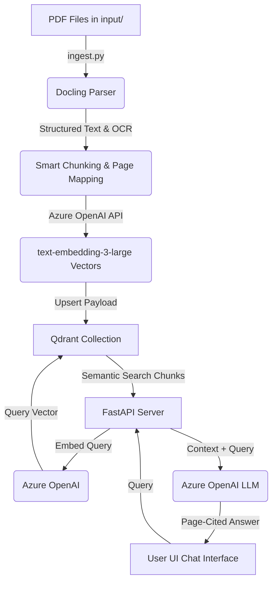

# PDF Semantic Search & Chat System (RAG)

An advanced Retrieval-Augmented Generation (RAG) system upgraded to index massive batches of PDF documents (2000+) using **Docling** for structured parsing, **Azure OpenAI ("text-embedding-3-large")** for high-dimensional embeddings, and **Qdrant** for local or remote vector database storage. Features a premium, cyber-themed responsive dark-mode chat interface with inline page-level citation highlights and a context inspector drawer.

---

## Architecture Overview


---

## 🛠️ Installation & Setup

### 1. Configure the Environment
Open the [.env](file:///.env) file at the root of the project and fill in your Azure OpenAI configuration details:
```env
# Azure OpenAI Credentials for Text Embedding
AZURE_OPENAI_API_KEY=YOUR_AZURE_OPENAI_API_KEY
AZURE_OPENAI_ENDPOINT=https://YOUR_RESOURCE_NAME.openai.azure.com/
AZURE_OPENAI_API_VERSION=2024-05-01-preview
AZURE_OPENAI_EMBEDDING_DEPLOYMENT=text-embedding-3-large

# Azure OpenAI Credentials for Chat / LLM (e.g. gpt-4o, gpt-35-turbo)
AZURE_OPENAI_CHAT_DEPLOYMENT=gpt-4o

# Qdrant Database Configuration
# Leave URL empty to run local database stored in project (qdrant_db/)
QDRANT_URL=
QDRANT_API_KEY=
QDRANT_COLLECTION_NAME=pdf_knowledge_base
```

### 2. Put your PDFs in the Input Directory
Put your trial PDF or the 2000 PDFs in the `input/` folder of the project workspace. 

---

## 🚀 How to Run

### Option A: Use the Web Chat UI (Recommended)
This is the easiest way. Start the FastAPI server and perform ingestion directly from the web interface.

1. **Start the FastAPI backend server**:
   ```bash
   python -m uvicorn app:app --reload
   ```
2. **Open your browser** to:
   [http://127.0.0.1:8000](http://127.0.0.1:8000)
3. **Click "Scan & Ingest PDFs"** in the sidebar. This scans the `input/` folder, parses any new files, embeds them, and uploads them to Qdrant. A live log panel will display processing progress!
4. **Chat with your documents** once ingestion completes.

### Option B: Command Line Ingestion
If you prefer running the ingestion pipeline through the CLI:
```bash
python ingest.py
```
This is fully resume-capable: if it gets interrupted or if you add new files to the `input/` directory later, running it again will automatically skip files that have already been indexed in Qdrant.

---

## 💎 Features
- **Local Qdrant Mode**: Runs vector storage locally on disk (requires zero Docker or external service configuration).
- **Batch Embedding**: Automatically batches OpenAI API embedding calls in sizes of 16 for high-throughput uploading.
- **Fail-Resilient JSON Caching**: Text extraction results are cached in `output/` as `<pdf_name>.json`. If ingestion fails or needs to be rerun, it reloads from cache instead of parsing the PDF again, saving hours of processing time on large document sets.
- **Page-Level Citations**: Keeps track of page boundaries for each text chunk. When chatting, the model answers with inline footnotes (e.g. `[1]`), and clicking the footnote or reference buttons slides out a side drawer highlighting the exact text snippet retrieved.
- **Responsive Dark Theme**: A premium glassmorphic interface built with Outfit typography and customized styling.
